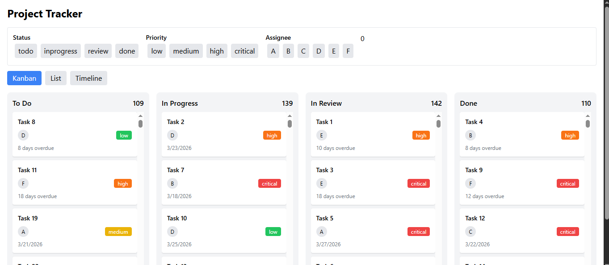
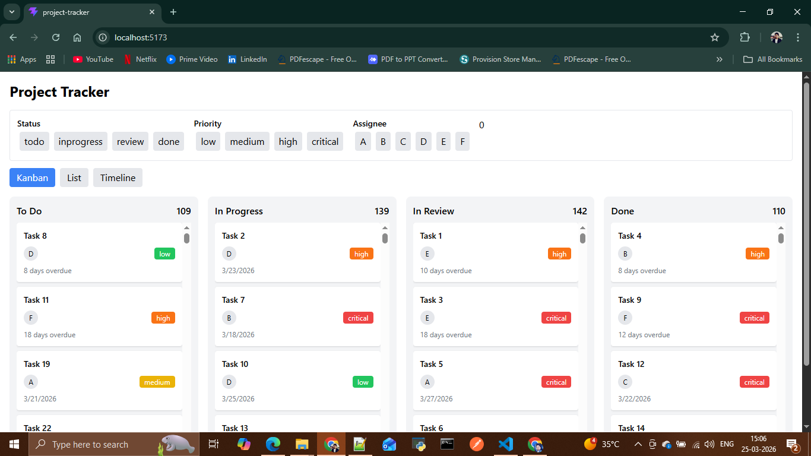
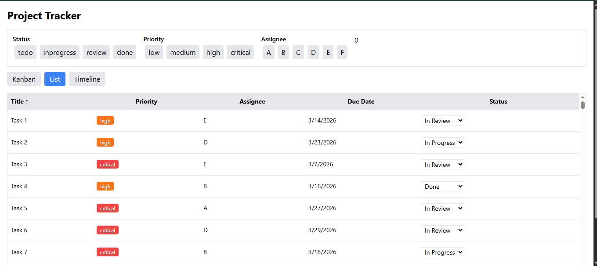
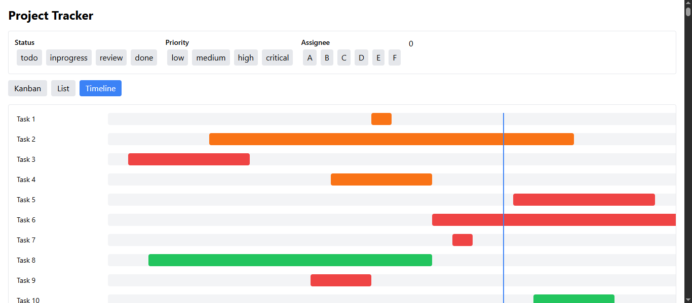
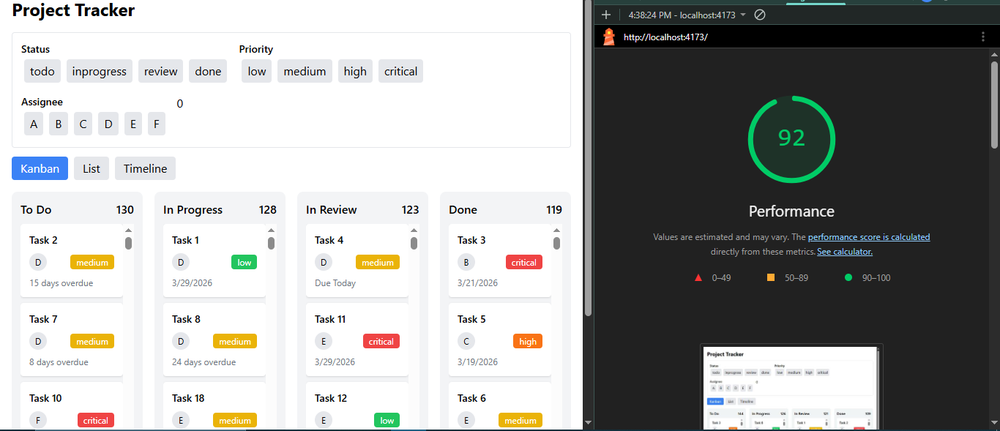
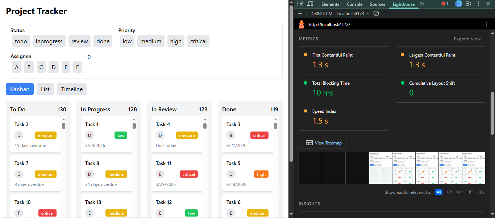

# Project Tracker

A high-performance task management dashboard built using React and TypeScript. The application is designed to handle large datasets efficiently while providing a smooth and responsive user experience.
---

## Setup Instructions

```bash
npm install
npm run dev

## Live Demo

https://project-tracker-woad-mu.vercel.app/

## Preview (sereennshots)

## Preview

### Kanban View

.png)


### List View

.png)

### Timeline View


## Lighthouse Score




## Tech Stack
- React (Vite)
- TypeScript
- Zustand (State Management)
- Tailwind CSS

## Features

### Kanban View
- Drag and drop tasks between columns
- Column highlight on drop target
- Placeholder handling to prevent layout shift
- Priority-based color indicators
- Due date labels (Due Today / Overdue)

### List View
- Sortable columns (Title, Priority, Due Date)
- Inline status editing
- Virtual scrolling (500+ tasks)

### Timeline View (Gantt)
- Horizontal timeline layout
- Task bars based on dates
- Priority-based color coding
- Today marker (vertical line)

## Live Collaboration Indicators

Simulated real-time user presence using interval-based updates.

- Multiple users are shown as active on different tasks
- Avatar indicators appear on task cards
- Users move between tasks dynamically
- Active users count is displayed at the top

## Scrollable layout
Filters and URL Synchronization
Multi-select filters (Status, Priority, Assignee)
Filters stored in URL query parameters
State restored on page refresh
Shareable filtered views
Key Implementations

## State Management Decision

Zustand was chosen for state management due to its lightweight nature and minimal boilerplate compared to Redux. It allows direct state updates without reducers, making the implementation simpler and more maintainable.

It also helps in reducing unnecessary re-renders by enabling selective subscriptions, which is important for performance in views like the Kanban board and virtualized list.

## Custom Drag and Drop

## Drag and Drop Approach

The drag-and-drop system was implemented using native HTML drag events without any external libraries.

Each task card becomes draggable using the draggable attribute. On drag start, the task data is stored and a visual drag effect is applied. A placeholder element of equal height is inserted at the original position to prevent layout shift.

Drop zones (Kanban columns) detect drag-over events and visually highlight valid targets. On drop, the task status is updated and the placeholder is removed.

If a task is dropped outside a valid column, it returns to its original position to maintain consistency.

## Virtual Scrolling Implementation

To handle large datasets efficiently, virtual scrolling was implemented from scratch in the list view.

Only the visible rows within the viewport are rendered along with a buffer of extra rows above and below. The visible range is calculated based on the scroll position and row height.

Spacer elements are used above and below the rendered rows to maintain the correct scroll height, ensuring smooth scrolling without layout jumps.

This approach significantly reduces DOM size and improves performance when rendering 500+ tasks.

## Optimized performance for large datasets:

- Calculated visible rows based on scroll position
- Rendered only required elements
- Used spacer elements to maintain scroll height
- URL Synchronization
- Managed filters using URLSearchParams
- Restored application state on page load
- Prevented initial state overwrite using an initialization flag

## Performance
Handles 500+ tasks smoothly
Optimized rendering using virtual scrolling
Efficient state updates with minimal re-renders


## Folder Structure
src/
 ├── components/   # Reusable UI components
 ├── store/        # Zustand state management
 ├── views/        # Kanban, List, Timeline
 ├── data/         # Mock or API data
 ├── types/        # TypeScript definitions
 
## Challenges and Solutions

- Implementing drag-and-drop without external libraries  
  Built a custom solution using native drag events and controlled state updates.

- Preventing layout shift during drag operations  
  Introduced a placeholder element to preserve layout consistency.

- Handling performance with large datasets  
  Implemented virtual scrolling to render only visible rows.

- Managing URL synchronization without overwriting initial state  
  Used an initialization guard to ensure correct state restoration.

## Explanation

- The most challenging part of this project was implementing custom drag-and-drop without using any external libraries. Handling the placeholder correctly to - prevent layout shifts required careful DOM manipulation and state synchronization.

- To maintain layout stability, a placeholder element with the same height as the dragged item was inserted at the original position. This ensured that other - elements did not shift unexpectedly during drag operations.

- Another challenge was implementing virtual scrolling while maintaining accurate scroll height and smooth user experience. This was solved by calculating - - visible rows dynamically and using spacer elements.


## Conclusion

This project demonstrates the ability to build scalable, performant frontend applications with clean state management, optimized rendering techniques, and practical user interface design.